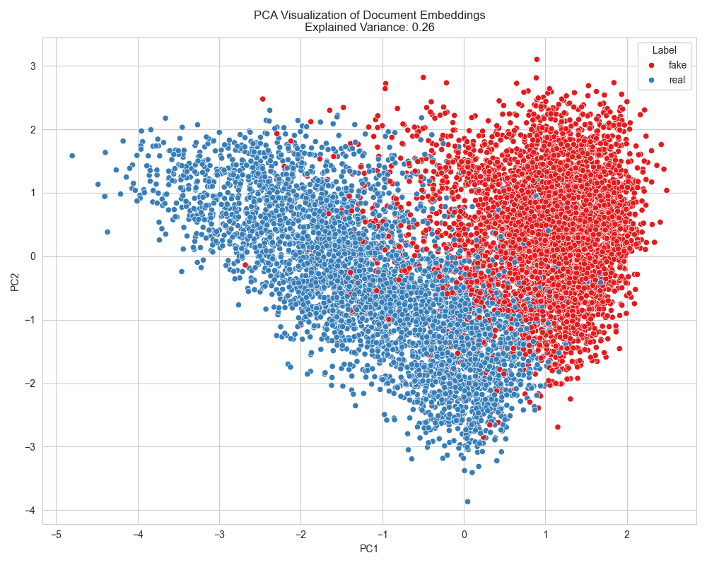
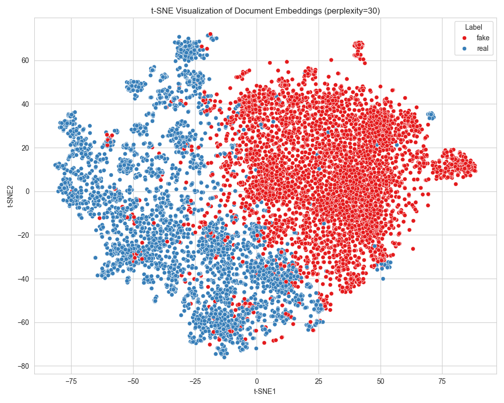

# Fake News Detector

## Project Overview
This project implements a machine learning system for detecting fake news articles. While the model architecture itself is relatively straightforward, the real innovation lies in the sophisticated data processing pipeline that efficiently handles large text datasets and optimizes the computation of text embeddings.

## Data Processing Pipeline: The Core Challenge

The most challenging aspect of fake news detection is not necessarily the classification model itself, but rather the efficient processing of large text datasets. Here's how this project tackles these challenges:

### 1. Efficient Embedding Computation

**Problem:** Computing embeddings for large text datasets is computationally expensive and time-consuming.

**Solution:** 
- Implemented a sliding window tokenization approach that handles long texts by breaking them into overlapping chunks
- Used DistilBERT's [CLS] token embeddings averaged across windows to create fixed-length document representations
- Leveraged CPU processing for stability with large datasets
- Optimized batch size (8) to balance memory usage and computation speed
- Employed model distillation (DistilBERT) to reduce memory footprint while maintaining accuracy

### Why Pre-computed Embeddings vs. Direct Tokenization

**Problem:** News articles often exceed the maximum context length of transformer models (512 tokens), and have variable lengths.

**Why not use tokenized values directly?**
While using tokenized IDs directly with a classifier is a valid approach for shorter texts, it has significant limitations for news article classification:

1. **Length Limitations:** News articles frequently exceed the 512 token limit of transformer models, requiring truncation that could discard critical information

2. **Variable Sequence Lengths:** Different articles have different lengths, complicating batch processing and requiring extensive padding

3. **Computational Complexity:** Processing full-length tokenized articles through deep models is computationally expensive

**Benefits of our embedding approach:**

1. **Fixed-Size Representation:** Each document becomes a fixed-length vector (768 dimensions) regardless of original text length

2. **Information Preservation:** By using sliding windows with overlap and averaging, we capture information from the entire article, even for very long texts

3. **Transfer Learning:** We leverage the pre-trained knowledge in the embedding model while simplifying the downstream classifier

4. **Efficiency:** Once computed and cached, embeddings enable much faster training and experimentation cycles

```python
# Example of sliding window tokenization
def sliding_window_tokenize(text, tokenizer, max_length=512, stride=128):
    return tokenizer(
        text,
        return_overflowing_tokens=True,
        stride=stride,
        max_length=max_length,
        truncation=True,
        padding="max_length",
        return_tensors="pt",
    )
```

### 2. Intelligent Caching Mechanism

**Problem:** Recomputing embeddings for the same texts across different experiments wastes computational resources.

**Solution:**
- Developed a content-aware caching system that generates unique cache keys based on:  
  - Model configuration (e.g., BERT variant, max sequence length)
  - Dataset properties (including file modification timestamps)
- Separated storage of embeddings and dataframes for memory efficiency
- Implemented cache invalidation when source data or model parameters change

### 3. Memory-Efficient Data Representation

**Problem:** Storing embeddings directly in dataframes is memory-intensive and inefficient.

**Solution:**
- Stored embeddings as separate tensors, with dataframes containing only indices
- Used float16 precision for embeddings to reduce memory footprint
- Implemented a custom dataset class that efficiently links dataframe records with their corresponding embeddings

### 4. Flexible Data Splitting

**Problem:** Traditional data splitting approaches often duplicate embeddings across train/val/test sets.

**Solution:**
- Implemented a specialized splitting function that maintains the relationship between dataframe rows and embeddings
- Ensured stratified sampling to maintain class distribution across splits
- Created a pipeline that computes embeddings only once before splitting

## Technical Implementation

The data pipeline is organized into several modular components:

1. **EmbeddingsProcessor**: Handles computation, caching, and retrieval of embeddings
2. **NewsDataset**: Custom PyTorch dataset that efficiently works with precomputed embeddings
3. **Dataloader**: Creates optimized data loaders for training, validation, and testing
4. **Tokenization**: Implements sliding window approach for handling long texts
5. **EmbeddingVisualizer**: Generates visualizations of embeddings using dimensionality reduction techniques

### Embedding Visualization

To better understand how the model distinguishes between real and fake news, the project includes embedding visualization capabilities:

<div align="center">
  
  
  <br>
  <em>Left: PCA projection of news article embeddings. Right: t-SNE projection showing clearer separation between classes.</em>
</div>

These visualizations reveal how the embedding space effectively separates real news (blue) from fake news (red), demonstrating the model's ability to learn discriminative features even before classification.

## Experiment Tracking

This project uses Weights & Biases (wandb) for experiment tracking, allowing for:
- Monitoring of training metrics
- Comparison of different model configurations
- Visualization of results

## Recent Updates (April 2025)

### Complete Training and Evaluation Pipeline

- **Model Architecture**: Implemented `FakeNewsClassifier` with configurable architecture for binary classification
- **Training System**: Created comprehensive `Trainer` class with:  
  - Early stopping
  - Model checkpointing
  - Learning rate optimization
  - Batch-level metrics tracking
- **Evaluation Metrics**: Added detailed evaluation with:  
  - Precision, recall, F1-score
  - Confusion matrix visualization
  - Classification reports
- **Weights & Biases Integration**: Full integration with wandb for experiment tracking:
  - Real-time metric logging
  - Visualization of training curves
  - Model artifact storage
  - Team: chen-ben968-benchen

### Inference and Deployment

- **Prediction System**: Created `NewsPredictor` class for real-time inference
- **Command-line Tools**: Implemented scripts for:  
  - Training: `scripts/train.py`
  - Evaluation: `scripts/evaluate.py`
  - Prediction: `scripts/predict.py`
- **Configuration System**: Centralized configuration with YAML files

## Future Improvements

- Implement more advanced embedding techniques (e.g., sentence-BERT)
- Add support for other transformer models
- Optimize for distributed computing environments
- Implement online learning capabilities for continuous model updating

## Scripts and Usage

The project includes three main scripts for training, evaluation, and prediction:

### 1. Training Script (`scripts/train.py`)

Trains the fake news detection model using the configured dataset and model architecture.

```bash
# Basic usage
uv run python -m scripts.train
```

**What it does:**
- Loads configurations from YAML files
- Creates necessary output directories
- Initializes and trains the model with early stopping
- Saves the best model checkpoint based on validation accuracy
- Evaluates the model on validation set
- Saves training history and evaluation results
- Optionally evaluates on test set if configured
- Integrates with Weights & Biases for experiment tracking

### 2. Evaluation Script (`scripts/evaluate.py`)

Performs detailed evaluation of the trained model and generates visualizations.

```bash
# Evaluate on validation set with best model
uv run python -m scripts.evaluate --best

# Evaluate on test set
uv run python -m scripts.evaluate --test

# Evaluate specific model checkpoint
uv run python -m scripts.evaluate --model_path ./outputs/checkpoints/my_model.pth

# Generate specific visualizations
uv run python -m scripts.evaluate --visualize --vis_methods pca,tsne,umap
```

**Key Features:**
- Detailed metrics: accuracy, precision, recall, F1-score
- Confusion matrix visualization with improved styling
- Advanced embedding visualizations:  
  - PCA for linear dimensionality reduction
  - t-SNE for non-linear manifold visualization
  - Optional UMAP for preserving both local and global structure
- Interactive visualizations when using Weights & Biases
- Saves results to JSON for further analysis
- Supports both validation and test set evaluation

### 3. Prediction Script (`scripts/predict.py`)

Makes predictions on new news articles using the trained model.

```bash
# Predict from a text file (default: sample_news.txt)
uv run python -m scripts.predict

# Predict a specific text
uv run python -m scripts.predict --text "This is a news article to classify"

# Predict from a specific file
uv run python -m scripts.predict --file path/to/articles.txt

# Show detailed prediction information
uv run python -m scripts.predict --verbose

# Use a specific model checkpoint
uv run python -m scripts.predict --model_path ./outputs/checkpoints/my_model.pth

# Save predictions to a specific file
uv run python -m scripts.predict --output my_predictions.json
```

**Features:**
- Colorful terminal output with emoji indicators (✅ for real, ❌ for fake)
- Confidence scores and certainty levels
- Batch processing for multiple articles
- Support for TXT and CSV file formats
- Multiple article processing with progress tracking
- Special article separator format (`===ARTICLE_SEPARATOR===`) for processing multiple articles in a single file

## Setup

```bash
# Install dependencies
uv pip install -r requirements.txt
```

## Configuration

The project uses modular YAML configuration files to control various aspects of the data pipeline, model architecture, and training:

### Configuration Files

- **dataset.yaml**: Controls data loading, processing, and splitting parameters
- **model.yaml**: Defines model architecture and classification settings
- **training.yaml**: Sets training hyperparameters and output directories

All configuration files are located in the `configs/` directory and are automatically loaded by the scripts. This modular approach allows for easy experimentation with different settings without changing code.

## Project Structure

```
fake_news_detector/
├── configs/                  # Configuration files
├── data/                     # Dataset files
├── outputs/
│   ├── checkpoints/          # Model checkpoints
│   ├── plots/                # Visualizations
│   └── results/              # Evaluation results
├── scripts/                  # Command-line tools
│   ├── train.py              # Training script
│   ├── evaluate.py           # Evaluation script
│   └── predict.py            # Prediction script
└── src/                      # Source code
    ├── data/                 # Data processing modules
    ├── inference/            # Inference modules
    ├── model/                # Model architecture
    ├── training/             # Training modules
    └── utils/                # Utility functions
```